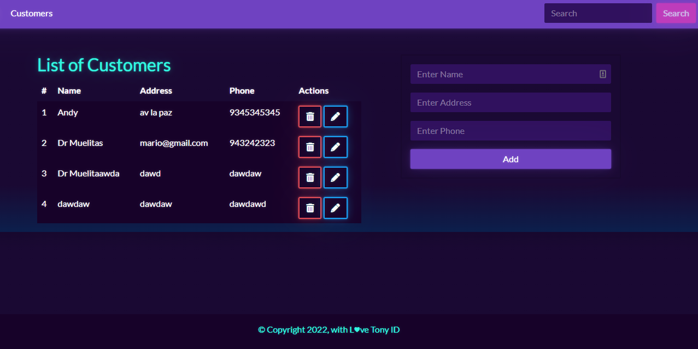

# Customer Data App

This is my practice project in js backend. I develop a web with a form and table from 0.

## Technologies

- NODE
- EXPRESS
- MYSQL
- EJS
- MORGAN
- NODEMON
- BOOTSWATCH
- FONTAWESOME

## Installation

    npm install

RUN script sql in mysql:

    db/db.sql

